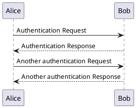

---
title = "PlantUML Diagrams"
---

# PlantUML Diagrams

If you have [PlantUML](http://plantuml.com/) installed and available on your path, _mkbook_ will try to render any code blocks with a language tag of `plantuml` as inline SVG images.

For example:

~~~

~~~

is rendered as:

This feature is still experimental, but I find it handy for my books.
